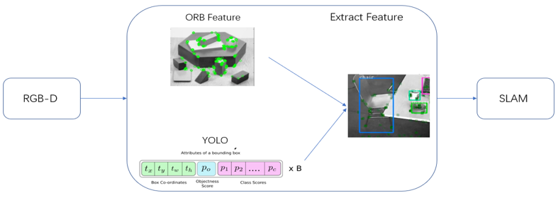
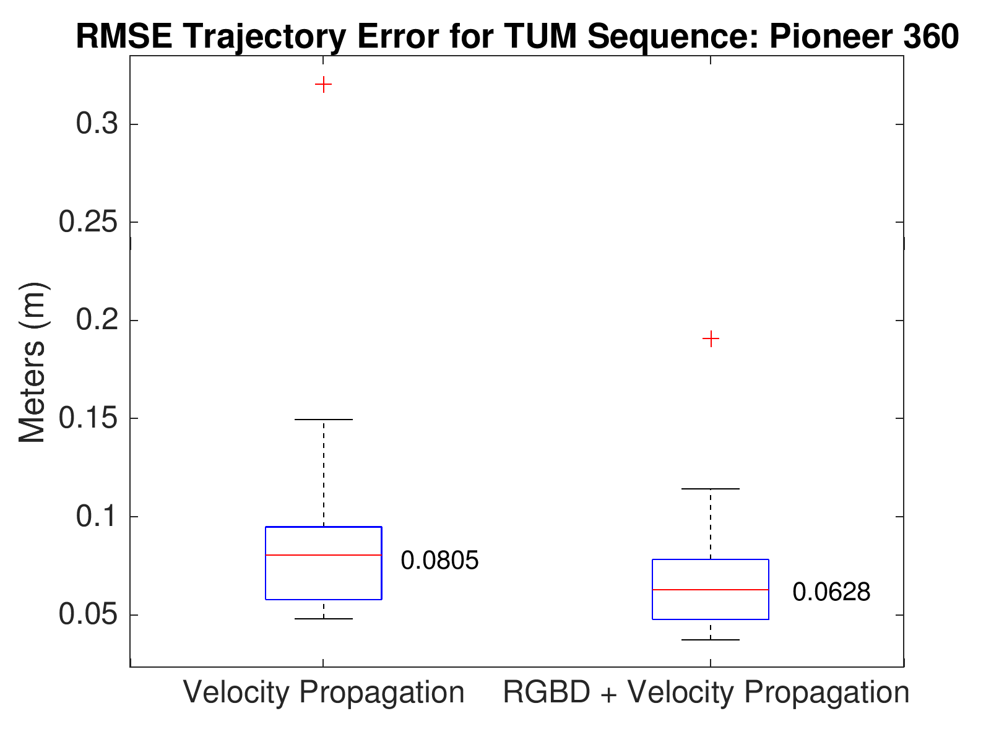
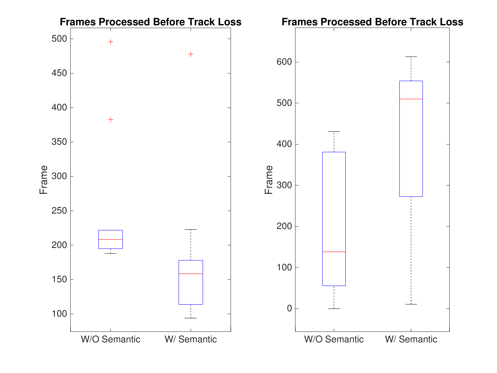

# Tracking Enhenced ORB-SLAM2

This repository is for Team 7 project of NAME 568/EECS 568/ROB 530: [__Mobile Robotics__](http://robots.engin.umich.edu/mobilerobotics/) of University of Michigan.

__Team members__: Madhav Achar, Siyuan Feng, Yue Shen, Hui Sun, Xi Lin

## TE-ORB_SLAM2
 TE-ORB_SLAM2 is a work that investigate two different methods to improve the tracking of [ORB-SLAM2](https://github.com/raulmur/ORB_SLAM2) in environments where it is difficult to extract ORB features. Methods are:
 * Incorporate high level semantic information from an object classification system such as [YOLOv3](https://pjreddie.com/darknet/yolo/) to improve ORB matching and association in frame by frame tracking. 
 
 * Utilize RGB-D odometry tracking based on the photo-consistency formulation of the frame-to-frame tracking problem performed in <cite>Real-time visual odometry from dense RGB-D images</cite> and implemented in OpenCV's RGB-D odometry class.

 ## License
 In our work we use the repos of [ORB-SLAM2](https://github.com/raulmur/ORB_SLAM2), [darknet](https://github.com/pjreddie/darknet), and [OpenCV-RgbdOdometry](https://github.com/tzutalin/OpenCV-RgbdOdometry)

ORB-SLAM2 is released under a [GPLv3 license](https://github.com/raulmur/ORB_SLAM2/blob/master/License-gpl.txt). For any commercial or academic usage, please visit ORB-SLAM2 github repo to ensure feasibility.

If you use TE-ORB_SLAM2, please cite the works in [Related Publications](#related-publications).


## Installation
For darknet and ORB-SLAM2, please install them separately. Our work has been tested on __Ubuntu 16.04__.

To download the entire repository, first to execute:
```
git clone https://github.com/Eralien/TE-ORB_SLAM2.git
cd TE-ORB_SLAM2
```
in your local directory.

We have different tags for different tasks. 
* To work on [ORB-SLAM2 with Semantics](#ORB-SLAM2-with-Semantics), execute:
```
git checkout tags/ORB-SLAM2_with_Semantics
```
* To work on  [ORB-SLAM2 with RGBD](#ORB-SLAM2-with-RGBD), execute:
```
git checkout tags/ORB-SLAM2_with_RGBD
```

### ORB-SLAM2 with Semantics
We encourage you to read ORB_SLAM2 [README](./ORB_SLAM2/README.md) for installation details first. Make sure you have installed these prerequisites:
* C++11 or C++0x Compiler
* Pangolin
* OpenCV, version higher than 2.4.3
* Eigen3

Once you finished building prerequisites, enter the TE-ORB_SLAM22 root directory and execute:
```
cd ORB_SLAM2
chmod +x build.sh
./build.sh
```

Once terminal returns 100% compile completion, please continue with the YOLOv3 installation part. Execute:
```
cd ../darknet
```

Installation of darknet is very easy. Modify the first five lines of [Makefile](./darknet/Makefile) according to your computer configuration. If you have installed CUDA, please edit the file:
```
GPU = 1
```
which will greatly accelerate the speed for image processing. Then execute:
```
make
```
You will have to download the pre-trained weight file [here (237 MB)](https://pjreddie.com/media/files/yolov3.weights). Or just run this:
```
wget https://pjreddie.com/media/files/yolov3.weights
```
Then run the detector to verify installation success:
```
./darknet detect cfg/yolov3.cfg yolov3.weights data/dog.jpg
```
Once you get a successfully printed out predict image, execute:
```
./dataset_dir_gen.sh
```
which will generate a `TUM_list.txt` and an empty `prediction_info_full.txt`. TUM_list.txt stores the TUM dataset `fr1_xyz` sequence filename we provided in [Sample directory](./Sample/). The `prediction_info_full.txt` will store the YOLO prediction information in the next few step. In `./bbox_gen.sh`, edit the TUM_DIR environment variable appropriately. Then execute:
```
./bbox_gen.sh
```
Running this bash script requires `expect`. If you don't have expect, it can be installed by yum, apt-get, or from source. You should notice prediction information printed on terminal and in `prediction_info.txt`. After the prediction info is created run the following commands:
```
cd parser
mkdir build && cd build && cmake ..
make
```

Then execute:
```
cp ./prediction_info_full.txt ../ORB_SLAM2/data
cp ./TUM_list.txt ../ORB_SLAM2/data
cd ../ORB_SLAM2
./Examples/Monocular/mono_tum Vocabulary/ORBvoc.txt Examples/Monocular/TUM1.yaml ../Sample/rgbd_dataset_freiburg1_xyz/rgb/
```

If you would like to use your own dataset with TUM, please edit [dataset_dir_gen.sh](./darknet/dataset_dir_gen.sh) and [bbox_gen.sh](./darknet/bbox_gen.sh) with your local dataset path, as well as adapt the last command above to your local path.

### ORB-SLAM2 with RGBD
Go to ORB-SLAM2 sub-directory first:
```
cd ORB_SLAM2
```
Generate the RGBD association file by downloading [associate.py](http://vision.in.tum.de/data/datasets/rgbd-dataset/tools). Follow the instructions to generate an `associations.txt`.
```
python associate.py PATH_TO_SEQUENCE/rgb.txt PATH_TO_SEQUENCE/depth.txt > associations.txt
```

Execute the following command. Change `TUMX.yaml` to TUM1.yaml, TUM2.yaml or TUM3.yaml for freiburg1, freiburg2 and freiburg3 sequences respectively. Change `PATH_TO_SEQUENCE_FOLDER` to the uncompressed sequence folder. Change `ASSOCIATIONS_FILE` to the path to the corresponding associations file.
```
./Examples/RGB-D/rgbd_tum Vocabulary/ORBvoc.txt Examples/RGB-D/TUMX.yaml PATH_TO_SEQUENCE_FOLDER ASSOCIATIONS_FILE
```

## Results



 ### Related Publications
 1. <cite>ORB-SLAM2: An Open-Source SLAM System for Monocular, Stereo, and RGB-D Cameras</cite>:
 ```
@ARTICLE{orbslam2, 
author={R. {Mur-Artal} and J. D. {Tardos}}, 
journal={IEEE Transactions on Robotics}, 
title={ORB-SLAM2: An Open-Source SLAM System for Monocular, Stereo, and RGB-D Cameras}, 
year={2017}, 
volume={33}, 
number={5}, 
pages={1255-1262}, 
keywords={cameras;distance measurement;Kalman filters;mobile robots;motion estimation;path planning;robot vision;SLAM (robots);ORB-SLAM;open-source SLAM system;lightweight localization mode;map points;zero-drift localization;SLAM community;monocular cameras;stereo cameras;simultaneous localization and mapping system;RGB-D cameras;Simultaneous localization and mapping;Cameras;Optimization;Feature extraction;Tracking loops;Trajectory;Localization;mapping;RGB-D;simultaneous localization and mapping (SLAM);stereo}, 
doi={10.1109/TRO.2017.2705103}, 
ISSN={1552-3098}, 
month={Oct},}
 ```
 2. <cite>Yolov3: An incremental improvement</cite>:
```
@article{redmon2018yolov3,
  title={Yolov3: An incremental improvement},
  author={Redmon, Joseph and Farhadi, Ali},
  journal={arXiv preprint arXiv:1804.02767},
  year={2018}
}
```

 3. <cite>Real-time visual odometry from dense RGB-D images</cite>:
 ```
 @INPROCEEDINGS{rgbd-odo, 
author={F. {Steinbrücker} and J. {Sturm} and D. {Cremers}}, 
booktitle={2011 IEEE International Conference on Computer Vision Workshops (ICCV Workshops)}, 
title={Real-time visual odometry from dense RGB-D images}, 
year={2011}, 
volume={}, 
number={}, 
pages={719-722}, 
keywords={distance measurement;image processing;iterative methods;target tracking;realtime visual odometry;dense RGB-D images;Microsoft Kinect camera;energy function;rigid body motion;twist coordinates;coarse-to-fine scheme;iterative closest point algorithm;camera motion;camera tracking applications;Cameras;Robots;Visualization;Equations;Iterative closest point algorithm;Three dimensional displays;Streaming media}, 
doi={10.1109/ICCVW.2011.6130321}, 
ISSN={}, 
month={Nov},}
 ```
